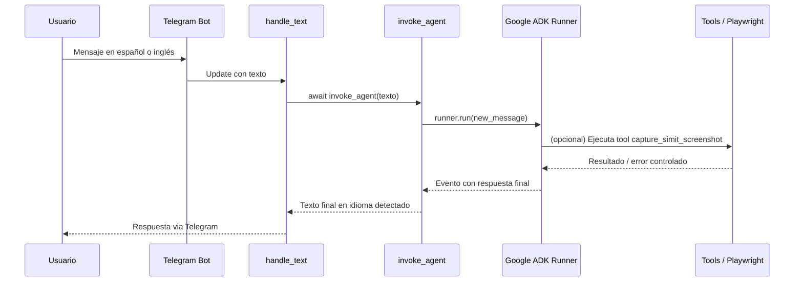

# Documentación General de TransmiBot

TransmiBot es un asistente conversacional que integra Telegram con el Google
Agent Development Kit (ADK) para responder consultas de movilidad en Colombia.
El bot guía a las personas usuarias, describe las herramientas disponibles y
puede capturar comprobantes del portal Simit mediante Playwright.

## Visión General de la Arquitectura

```mermaid
flowchart LR
    User[Usuario de Telegram]
    BotAPI[Telegram Bot API]
    AppMain[app.main]
    TgApp[Telegram Application]
    Handler[handlers.handle_text]
    AgentRuntime[transmi_agent.agent]
    Tools[transmi_agent.tools]
    DB[app.db (SQLite)]
    Simit[Simit Web]
    GoogleADK[(Google ADK)]

    User -->|Mensajes| BotAPI
    BotAPI -->|Webhook/Polling| AppMain
    AppMain --> TgApp
    TgApp --> Handler
    Handler -->|await| AgentRuntime
    Handler -->|registra uso| DB
    AgentRuntime -->|Runner| GoogleADK
    AgentRuntime -->|Invoca| Tools
    Tools -->|Playwright| Simit
```

- `app.main` inicializa logging, carga configuración y arranca el motor de
  Telegram en modo webhook o polling.
- `app.telegram.bot` registra los command handlers y delega las actualizaciones
  al módulo `handlers`.
- `app.agents.transmi_agent.agent` prepara el agente del ADK, garantiza la
  sesión y ejecuta la inferencia en segundo plano.
- `app.agents.transmi_agent.tools` implementa las herramientas disponibles para
  el agente (hora actual, captura Simit y consultas a TomTom para rutas y
  servicios cercanos).

## CI/CD y GitHub Actions

- **Repositorio Git:** sigue Git Flow con ramas `main`, `develop` y `feature/*`.
- **CI con GitHub Actions:** existe un workflow (`.github/workflows/docker-build.yml`)
  que construye la imagen Docker en cada `push` o `pull_request` sobre `main` y
  `develop` usando `docker/build-push-action@v6` (sin publicar aún la imagen).
- **CD manual:** el despliegue a Cloud Run u otros entornos se realiza de forma
  manual mediante comandos documentados en `deployment.md`, lo que permite
  revisiones y aprobaciones explícitas.

## Flujo Conversacional Simplificado



## Principios de Diseño

- **SOLID & alta cohesión**: cada módulo encapsula su responsabilidad (config,
  logging, bot, herramientas, agente).
- **Manejo robusto de errores**: excepciones específicas (`ConfigurationError`,
  `ExternalServiceError`) y registros detallados durante la automatización con
  Playwright.
- **Observabilidad**: logging configurable via `APP_LOG_LEVEL` y mensajes
  estructurados.
- **Testabilidad**: las herramientas y el agente exponen funciones puras o
  asíncronas fácilmente aislables en pruebas.

Más detalles en los archivos complementarios:

- `modules.md`: descripción de componentes y dependencias.
- `libraries.md`: bibliotecas y servicios externos.
- `operations.md`: despliegue, configuración y requisitos operativos.
 - `deployment.md`: detalles del flujo de despliegue en Cloud Run y del CI/CD.

