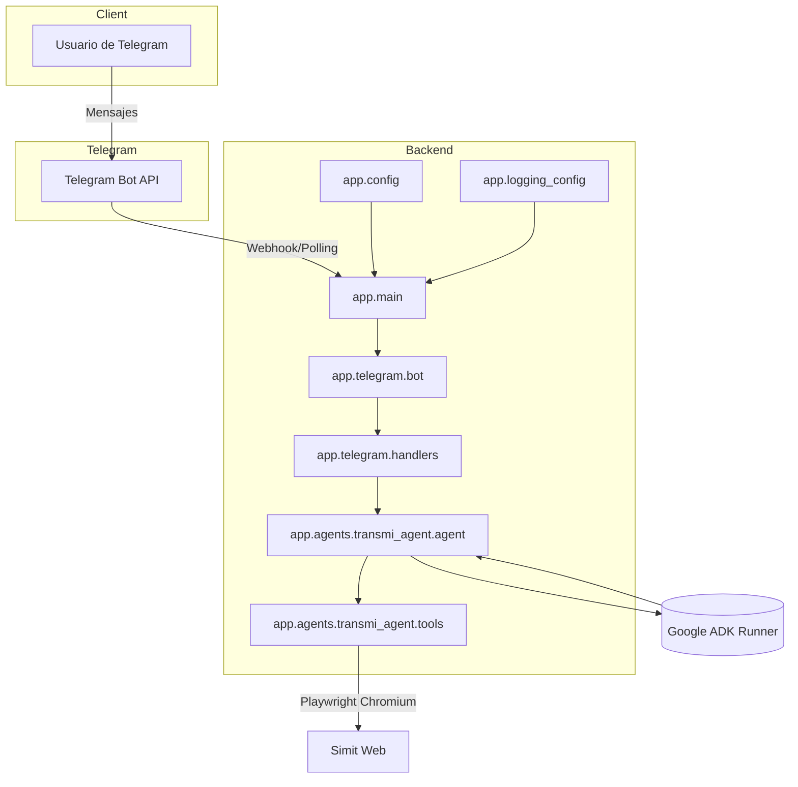

# Documento de Arquitectura de TransmiBot

## Arquitectura del sistema

TransmiBot es un asistente conversacional que integra Telegram con el Google
Agent Development Kit (ADK) para resolver consultas de movilidad colombiana y
gestionar flujos que requieren captura de información del portal Simit.

- **Flujo de mensajes**: las actualizaciones llegan desde Telegram al backend,
  que ejecuta lógica de negocio y delega la inferencia al runner de Google ADK.
- **Herramientas**: cuando se requiere información adicional (hora, captura
  Simit) el agente invoca funciones específicas que utilizan Playwright para
  automatización web.
- **Observabilidad**: todo el backend comparte la misma configuración de
  logging, con niveles ajustables y mensajes estructurados.

## Base de datos

El proyecto actual **no utiliza una base de datos persistente**. Se confía en:

- `InMemorySessionService` de Google ADK para almacenar sesiones temporales del
  agente.
- Sistema de archivos (`var/screenshots/`) para guardar capturas de Simit.

Si se requiriera una base de datos en el futuro (por ejemplo, para persistir
historial de conversaciones o caché de rutas), se sugiere:

- **Lógico**: colecciones/tablas para usuarios, consultas y resultados de tools.
- **Físico**: servicio gestionado (p.ej. Firestore, PostgreSQL). Integración vía
  capa de repositorios en `app/services/` conectada al backend.

## Backend

- Implementado en **Python 3.12**, con `python-telegram-bot` para la capa de
  transporte y Google ADK para LLM orchestration.
- **API REST / GraphQL**: la comunicación primaria se realiza por la API de
  Telegram; no se expone una API HTTP propia. De ser necesaria, `FastAPI` o
  `Starlette` podrían convivir dentro del mismo proyecto.
- **Lógica de negocio**: encapsulada en `handlers.handle_text` e
  `invoke_agent`. Se valida la entrada, se controla la creación de sesiones y se
  responde con mensajes amigables incluso ante fallos.
- **Seguridad básica**: se confía en el token de Telegram y en la API Key de
  Google ADK. Las credenciales se cargan desde variables de entorno; se recomienda
  almacenarlas en un secret manager en producción.

## Frontend

El proyecto no incluye un frontend propio (web o móvil). La interfaz es el
cliente de **Telegram** (móvil, web o desktop). Para incorporar un frontend:

- Crear una SPA o app móvil que consuma el backend a través de endpoints REST.
- Utilizar Webhooks o WebSockets para reflejar actualizaciones en tiempo real.
- Mantener sincronización con Telegram para usuarios que prefieran ese canal.

## APIs

- **Propias**: no existen endpoints HTTP/REST internos. Toda la interacción es
  vía Telegram. Sin embargo, `invoke_agent` expone una interfaz Python estable
  que podría ser reutilizada en otros contextos.
- **Externas**:
  - Telegram Bot API para recepción y envío de mensajes.
  - Portal Simit (navegación automatizada) para capturas de estado.
  - Google Gemini (a través de Google ADK) para razonamiento del agente.

## Inteligencia Artificial

- Integración con **Google ADK** usando modelos Gemini (`google_agent_model`).
- El agente está configurado con prompt en español, detecta idioma de entrada y
  promueve el uso de herramientas (`get_current_time`, `capture_simit_screenshot`).
- Posibles extensiones: clasificación de intención previa, embedding de rutas o
  integración con APIs de planeación de transporte (TransMilenio o SITP).

## Despliegue en la nube

- El proyecto puede ejecutarse en cualquier plataforma que soporte Python 3.12.
- Consideraciones clave:
  - **Contenedores**: el `Dockerfile` base junto con `make docker-build` permite
    empaquetar la app. Incluir dependencias de Playwright (`playwright install-deps`).
  - **Webhook**: requiere URL pública (p.ej. Cloud Run, App Engine, Heroku) y
    certificados válidos. Caso contrario, se usa `run_polling`.
  - **Almacenamiento**: persistir `var/screenshots/` en disco duradero o en
    buckets. Opcionalmente, subir automáticamente la captura a almacenamiento en la nube.
  - **Secretos**: gestionar `TELEGRAM_BOT_TOKEN` y `GOOGLE_API_KEY` mediante
    sistemas como Secret Manager o Vault.
  - **Monitoreo**: integrar con servicios de logging (Stackdriver, CloudWatch) y
    alertas para fallos de Playwright o límites de API de Telegram.

## Resumen de tecnologías utilizadas

| Capa | Tecnología |
| ---- | ---------- |
| Interfaz | Telegram (clientes oficiales) |
| Backend | Python 3.12, `python-telegram-bot`, `google-adk` |
| IA | Gemini via Google ADK |
| Automatización web | Playwright (Chromium headless) |
| Configuración | `pydantic-settings` |
| Logging | Logging estándar de Python con configuración centralizada |

