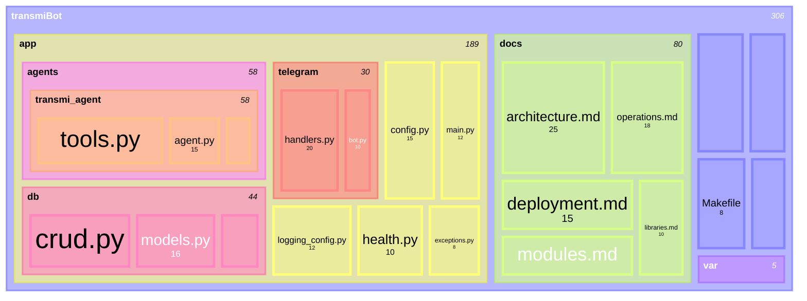
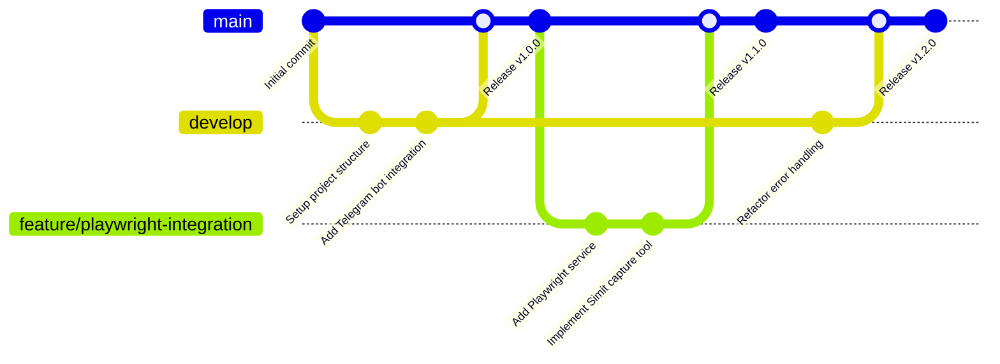
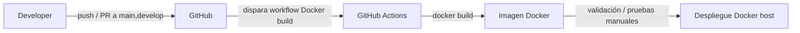
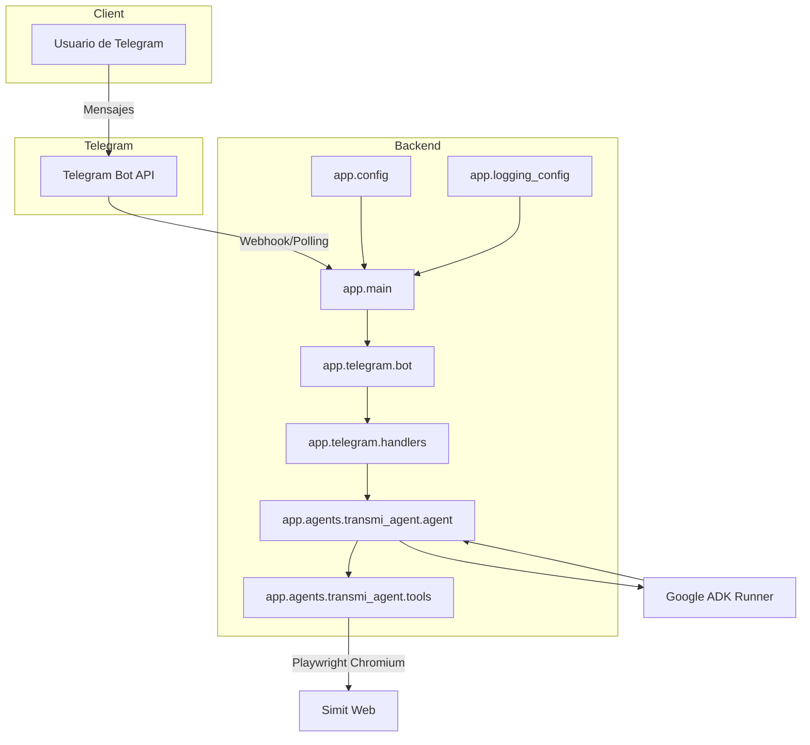

# Documento de Arquitectura de TransmiBot

## Visión General

TransmiBot es un asistente conversacional que integra Telegram con el Google Agent Development Kit (ADK) para resolver consultas de movilidad colombiana y gestionar flujos que requieren captura de información del portal Simit.

La aplicación sigue una **arquitectura monolítica** dockerizada, expuesta como webhook público mediante Cloudflare Tunnel (cloudflared), ejecutándose en un servidor Linux local (portátil reutilizado) que permanece encendido 24/7 en la red local.

## Estructura del Proyecto

## Arquitectura del Sistema

### Componentes Principales

1. **Telegram Bot API**: Servicio externo que recibe mensajes de usuarios y los reenvía al webhook.
2. **Cloudflare Tunnel (cloudflared)**: Túnel que expone el servicio local a Internet de forma segura sin necesidad de abrir puertos en el router.
3. **TransmiBot Container**: Contenedor Docker que encapsula toda la aplicación monolítica:
   - **Webhook Endpoint**: Recibe actualizaciones de Telegram en el puerto 8080.
   - **Telegram Bot Handler**: Procesa mensajes y comandos de Telegram.
   - **Google ADK Agent**: Orquesta las respuestas usando el modelo Gemini.
   - **Playwright Service**: Automatiza la navegación web para capturar información del portal Simit.
4. **File Storage**: Almacenamiento local persistente para capturas de pantalla (`var/screenshots/`).

### Flujo de Datos

1. **Recepción de Mensajes**: Usuario envía mensaje → Telegram Bot API → Cloudflare Tunnel → Webhook Endpoint.
2. **Procesamiento**: Webhook → Telegram Bot Handler → Google ADK Agent.
3. **Consultas Externas**:
   - Si requiere IA: Google ADK Agent → Google Gemini API.
   - Si requiere captura Simit: Google ADK Agent → Playwright Service → Portal Simit → File Storage.
4. **Respuesta**: El flujo se invierte hasta llegar al usuario en Telegram.

## Estrategia de Git

El proyecto utiliza **Git Flow** como estrategia de gestión de ramas:

### Ramas Principales

- **`main`**: Rama de producción. Contiene código estable y desplegado.
- **`develop`**: Rama de desarrollo. Integra todas las características nuevas.
- **`feature/*`**: Ramas para nuevas funcionalidades. Se crean desde `develop` y se fusionan de vuelta a `develop`.

### Convenciones de Commits

Todos los commits siguen el formato **Conventional Commits**:

- `feat(scope): descripción` - Nueva funcionalidad
- `fix(scope): descripción` - Corrección de bug
- `docs(scope): descripción` - Cambios en documentación
- `refactor(scope): descripción` - Refactorización de código
- `test(scope): descripción` - Añadir o modificar tests
- `chore(scope): descripción` - Cambios en build o herramientas

## Arquitectura de Despliegue

### Infraestructura

- **Servidor**: Portátil Linux reutilizado, encendido 24/7 en red local.
- **Containerización**: Docker con `docker-compose` para gestión del ciclo de vida.
- **Exposición Pública**: Cloudflare Tunnel (cloudflared) crea un túnel seguro sin necesidad de configuración de router o DNS dinámico.
- **Persistencia**: Volúmenes Docker para `var/screenshots/` y configuración.

### Configuración de Cloudflare Tunnel

El servicio `cloudflared` se ejecuta como servicio del sistema en el servidor Linux, creando un túnel que:

- Expone el puerto 8080 del contenedor TransmiBot a Internet.
- Proporciona una URL pública HTTPS (ej: `https://transmibot-xxxxx.trycloudflare.com`).
- No requiere abrir puertos en el router ni configuración de firewall compleja.

### Docker Compose

El archivo `docker-compose.yml` configura:

- Construcción automática de la imagen.
- Reinicio automático del contenedor (`restart: always`).
- Mapeo de puertos `8080:8080`.
- Carga de variables de entorno desde `.env`.
- Persistencia de volúmenes para capturas.

### CI/CD con GitHub Actions

Para garantizar que la imagen de TransmiBot se construye de forma repetible en cada cambio relevante, se utiliza un workflow de **GitHub Actions** (`.github/workflows/docker-build.yml`) que actúa como fase de _Continuous Integration_.

- **Disparadores:** `push` y `pull_request` sobre `main` y `develop`.
- **Job principal (`docker-build`):**
  - Usa `actions/checkout@v4` para obtener el código.
  - Configura `docker/setup-buildx-action@v3`.
  - Lanza `docker/build-push-action@v6` para construir la imagen usando `Dockerfile`.
- **Estado actual:** el workflow **no publica** la imagen en un registro ni realiza despliegues automáticos (`push: false`), lo que reduce superficie de error y mantiene el CD como paso explícito controlado por la persona desarrolladora.
- **Estrategia recomendada de evolución:** en el futuro, se puede extender este flujo para:
  - Hacer `push` de la imagen a Artifact Registry / Docker Hub.
  - Desencadenar despliegues a Cloud Run u otra plataforma basada en contenedores.
  - Añadir pasos de linters y tests automatizados antes de construir la imagen.

## Arquitectura de Software (Detalle)

- **Flujo de mensajes**: las actualizaciones llegan desde Telegram al backend, que ejecuta lógica de negocio y delega la inferencia al runner de Google ADK.
- **Herramientas**: cuando se requiere información adicional (hora, captura Simit) el agente invoca funciones específicas que utilizan Playwright para automatización web.
- **Observabilidad**: todo el backend comparte la misma configuración de logging, con niveles ajustables y mensajes estructurados.

## Base de datos

La aplicación utiliza una base de datos **SQLite** ligera para registrar información básica de uso y mantener trazabilidad mínima por número de teléfono:

- Archivo de base de datos: `var/transmibot.db`.
- Motor: `SQLAlchemy` con `SessionLocal` y `Base` definidos en `app.db.session`.
- Inicialización: `app.main` invoca `init_db()` al arrancar para crear tablas de forma idempotente.

### Modelo lógico

Las tablas principales son:

- **`users`**:
  - Identificada por `phone_number` (clave lógica principal).
  - Campos adicionales: `telegram_id`, `username`, `first_name`, `last_name`, `created_at`, `last_seen_at`.
- **`interactions`**:
  - Una fila por mensaje que el usuario envía al bot.
  - Referencia a `users` mediante `user_id` y campo denormalizado `phone_number` para consultas rápidas.
- **`plates`**:
  - Registra placas consultadas en flujos Simit.
  - Incluye `user_id`, `phone_number`, `plate`, `created_at`.
- **`address_searches`**:
  - Guarda las direcciones y consultas relacionadas con TomTom (geocoding, rutas, lugares cercanos).
  - Campos: `user_id`, `phone_number`, `raw_query`, `context`, `created_at`.

### Flujo de datos hacia la BD

1. En los handlers de Telegram, cuando el usuario comparte su contacto, se extrae `phone_number` y se sincroniza un registro en `users`.
2. Cada mensaje de texto se registra como una entrada en `interactions` asociada al teléfono.
3. Las tools del agente (`capture_simit_screenshot`, `tomtom_*`) aceptan de forma opcional `phone_number` y, si está presente, registran:
   - Placas consultadas en `plates`.
   - Direcciones origen/destino o búsquedas de lugares en `address_searches`, con un campo `context` que indica el tipo de consulta (`geocode`, `route_origin`, `route_destination`, `nearby_services`, etc.).

La estrategia de manejo de errores es defensiva: cualquier fallo de la BD se captura, se loguea y **no** bloquea el flujo principal del bot (el usuario sigue recibiendo respuesta).

## Backend

- Implementado en **Python 3.12**, con `python-telegram-bot` para la capa de transporte y Google ADK para LLM orchestration.
- **API REST / GraphQL**: la comunicación primaria se realiza por la API de Telegram; no se expone una API HTTP propia. De ser necesaria, `FastAPI` o `Starlette` podrían convivir dentro del mismo proyecto.
- **Lógica de negocio**: encapsulada en `handlers.handle_text` e `invoke_agent`. Se valida la entrada, se controla la creación de sesiones y se responde con mensajes amigables incluso ante fallos.
- **Seguridad básica**: se confía en el token de Telegram y en la API Key de Google ADK. Las credenciales se cargan desde variables de entorno; se recomienda almacenarlas en un secret manager en producción.

## Frontend

El proyecto no incluye un frontend propio (web o móvil). La interfaz es el cliente de **Telegram** (móvil, web o desktop). Para incorporar un frontend:

- Crear una SPA o app móvil que consuma el backend a través de endpoints REST.
- Utilizar Webhooks o WebSockets para reflejar actualizaciones en tiempo real.
- Mantener sincronización con Telegram para usuarios que prefieran ese canal.

## APIs

- **Propias**: no existen endpoints HTTP/REST internos. Toda la interacción es vía Telegram. Sin embargo, `invoke_agent` expone una interfaz Python estable que podría ser reutilizada en otros contextos.
- **Externas**:
  - Telegram Bot API para recepción y envío de mensajes.
  - Portal Simit (navegación automatizada) para capturas de estado.
  - Google Gemini (a través de Google ADK) para razonamiento del agente.

## Inteligencia Artificial

- Integración con **Google ADK** usando modelos Gemini (`google_agent_model`).
- El agente está configurado con prompt en español, detecta idioma de entrada y promueve el uso de herramientas (`get_current_time`, `capture_simit_screenshot`).
- Posibles extensiones: clasificación de intención previa, embedding de rutas o integración con APIs de planeación de transporte (TransMilenio o SITP).

## Despliegue en la nube

- El proyecto puede ejecutarse en cualquier plataforma que soporte Python 3.12.
- Consideraciones clave:
  - **Contenedores**: el `Dockerfile` base junto con `make docker-build` permite empaquetar la app. Incluir dependencias de Playwright (`playwright install-deps`).
  - **Webhook**: requiere URL pública (p.ej. Cloud Run, App Engine, Heroku) y certificados válidos. Caso contrario, se usa `run_polling`.
  - **Almacenamiento**: persistir `var/screenshots/` en disco duradero o en buckets. Opcionalmente, subir automáticamente la captura a almacenamiento en la nube.
  - **Secretos**: gestionar `TELEGRAM_BOT_TOKEN` y `GOOGLE_API_KEY` mediante sistemas como Secret Manager o Vault.
  - **Monitoreo**: integrar con servicios de logging (Stackdriver, CloudWatch) y alertas para fallos de Playwright o límites de API de Telegram.

## Resumen de tecnologías utilizadas

| Capa                 | Tecnología                                                |
| -------------------- | --------------------------------------------------------- |
| Interfaz             | Telegram (clientes oficiales)                             |
| Backend              | Python 3.12, `python-telegram-bot`, `google-adk`          |
| IA                   | Gemini via Google ADK                                     |
| Automatización web   | Playwright (Chromium headless)                            |
| Configuración        | `pydantic-settings`                                       |
| Logging              | Logging estándar de Python con configuración centralizada |
| Containerización     | Docker, Docker Compose                                    |
| Túnel Público        | Cloudflare Tunnel (cloudflared)                           |
| Control de Versiones | Git con Git Flow                                          |
