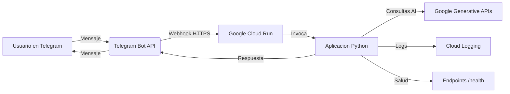
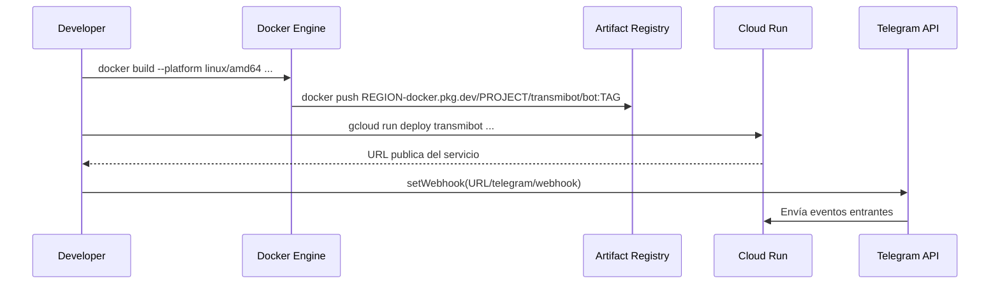
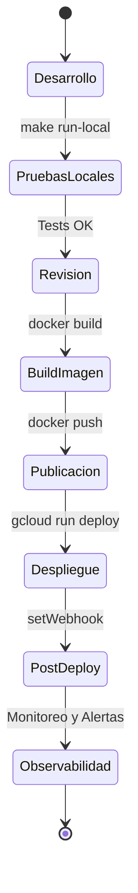

# Panorama del Despliegue

Este documento detalla por qué y cómo se despliega el bot de Telegram en Google Cloud Run utilizando contenedores Docker. Describe la arquitectura, los puntos de integración, la estrategia de configuración y los mecanismos operativos que garantizan resiliencia, trazabilidad y un manejo robusto de errores.

## Contexto y Objetivos

- **Dominio del problema:** Asistente de transporte público expuesto vía bot de Telegram.
- **Tipo de aplicación:** Backend orientado a eventos que reacciona a webhooks de Telegram.
- **Motivación para Cloud Run:** Plataforma serverless que escala a cero, elimina costos en reposo y ofrece escalado horizontal automático bajo demanda.
- **Integraciones clave:** Telegram Bot API mediante HTTPS y webhooks, APIs generativas de Google (configuradas con `google_api_key`), y servicios de control de Google Cloud (Artifact Registry y Cloud Run).

## Arquitectura de Alto Nivel

1. **Imagen de contenedor:** El bot en Python (basado en `python-telegram-bot`, `aiohttp` y el Google Agents SDK) se empaqueta en una imagen Docker definida en el `Dockerfile` de la raíz del repositorio.
2. **Repositorio de artefactos:** La imagen se publica en Google Artifact Registry, que actúa como registro privado versionado.
3. **Plataforma de ejecución:** Cloud Run aprovisiona el contenedor como un servicio gestionado, encargándose de balanceo, HTTPS, inyección de secretos, despliegues progresivos y escalado.
4. **Entrada vía webhooks:** Telegram envía los mensajes al endpoint HTTPS expuesto por Cloud Run (`TELEGRAM_WEBHOOK_URL`). La app utiliza `application.run_webhook(...)` y escucha en el `PORT` asignado por Cloud Run.
5. **Salud y disponibilidad:** `src/app/health.py` expone endpoints livianos para chequeos de estado que Cloud Run consume antes de enrutar tráfico.

La arquitectura prioriza simplicidad, portabilidad y bajo acoplamiento para facilitar iteraciones rápidas y mitigación de fallos.

## Flujo de Despliegue

1. **Construcción:** `docker build --platform linux/amd64 -t REGION-docker.pkg.dev/PROJECT/transmibot/bot:TAG .`
2. **Publicación:** `docker push REGION-docker.pkg.dev/PROJECT/transmibot/bot:TAG`
3. **Despliegue:** `gcloud run deploy transmibot --image REGION-docker.pkg.dev/PROJECT/transmibot/bot:TAG --platform managed --region REGION --memory 1Gi --allow-unauthenticated`
4. **Webhook:** Configurar el webhook de Telegram (por CLI o API) apuntando a `https://SERVICE-REGION-...run.app/telegram/webhook`.

El pipeline de CI/CD basado en GitHub Actions puede automatizar parte o todas estas etapas,
pero la secuencia conceptual se mantiene: construir → publicar → desplegar → registrar webhook.

## CI/CD con GitHub Actions

Este repositorio incluye un workflow básico de GitHub Actions (`.github/workflows/docker-build.yml`)
orientado a **integración continua**:

- **Evento:** `push` y `pull_request` sobre `main` y `develop`.
- **Objetivo:** construir la imagen Docker definida en `Dockerfile` mediante
  `docker/build-push-action@v6` (actualmente sin publicarla).
- **Beneficio:** detectar de forma temprana errores de build, cambios incompatibles
  en dependencias o roturas en el `Dockerfile`.

Por diseño, el **despliegue (CD)** sigue siendo un paso manual controlado por la persona
desarrolladora, a través de comandos `gcloud run deploy` o ejecución en un host Docker.
Esto facilita:

- Revisión previa de cambios en entornos de staging.
- Aplicar prácticas de aprobación manual (p.ej. `git tag` o releases).

En una siguiente iteración, este workflow puede ampliarse para:

- Hacer `push` de la imagen al registro de contenedores.
- Automatizar el despliegue a Cloud Run (incluyendo pasos de smoke tests).
- Integrar notificaciones (Slack, correo) con el resultado de cada ejecución.

## Configuración en Ejecución

Las variables de entorno se validan y tipan mediante `src/app/config.py` (Pydantic `Settings`), asegurando contratos explícitos y manejo temprano de errores de configuración:

- `TELEGRAM_BOT_TOKEN`: credencial de acceso al Bot API.
- `TELEGRAM_WEBHOOK_URL` / `TELEGRAM_WEBHOOK_PATH`: definición del endpoint HTTPS público.
- `TELEGRAM_ALLOWED_UPDATES`: lista opcional normalizada por `_normalize_allowed_updates`.
- `GOOGLE_API_KEY`, `GOOGLE_AGENT_MODEL`, `GOOGLE_AGENT_NAME`: parámetros para la interacción con Google Agents.
- `APP_ENV`, `APP_LOG_LEVEL`, `PORT`: ajustes operativos inyectados por Cloud Run.

Los secretos se gestionan desde la configuración cifrada de Cloud Run (o referencias a Secret Manager), evitando incluir credenciales dentro de la imagen.

## Estrategia de Manejo de Errores y Observabilidad

- **Logging estructurado:** `src/app/logging_config.py` habilita trazas consistentes con niveles controlados por `APP_LOG_LEVEL`. Cloud Run reenvía los logs a Cloud Logging.
- **Excepciones de dominio:** `src/app/exceptions.py` define jerarquías (`ConfigurationError`, `ExternalServiceError`) para capturar y propagar fallos con mensajes orientados a depuración.
- **Trazabilidad de solicitudes:** Las respuestas del bot y errores críticos deben registrarse con IDs correlacionables (p.ej. `update_id` de Telegram) para facilitar auditorías.
- **Monitoreo activo:** Recomendado configurar alertas en Cloud Monitoring para errores HTTP 5xx, excesos de memoria, cold starts prolongados y latencia de respuesta.
- **Endpoints de salud:** `src/app/health.py` soporta chequeos de liveness y readiness, reduciendo falsos positivos en despliegues.

## Recursos y Rendimiento

- **Memoria:** Se elevó el límite a **1 GiB** tras detectar reinicios por exceder los 512 MiB. Vigilar el consumo y ajustar según patrones de tráfico.
- **Concurrencia:** El valor por defecto (80 peticiones simultáneas) normalmente es suficiente; puede bajarse si se prioriza latencia o subirse si aumentan los volúmenes.
- **Escala a cero:** El servicio no consume CPU mientras está inactivo; minimizar el tamaño de la imagen ayuda a reducir el tiempo de arranque en frío.
- **Dependencias externas:** Considerar reintentos exponenciales y timeouts explícitos en consumo de Telegram o APIs de Google para aislar fallas de red.

## Pruebas Locales e Iteración

- **Ejecución local:** `make run-local` o `python -m app.main` arrancan el servicio en `localhost:${PORT}`; puede replicarse la configuración de Cloud Run usando Docker Compose y las mismas variables de entorno.
- **Simulación de webhooks:** Herramientas como `ngrok`, Cloud Run domain mappings o entornos de staging facilitan pruebas sin afectar producción.
- **Contratos y regresiones:** Diseñar pruebas de integración que mockeen payloads de Telegram y respuestas de Google para validar comportamiento antes de desplegar.

## Recomendaciones Futuras

- Automatizar builds con Cloud Build o GitHub Actions para garantizar entregas repetibles y auditables.
- Integrar Secret Manager y rotaciones periódicas de credenciales.
- Añadir pruebas de carga sobre el endpoint `/telegram/webhook` antes de picos previstos.
- Documentar procedimientos de rollback y playbooks de incidentes para responder ante errores críticos o degradación de servicios externos.
