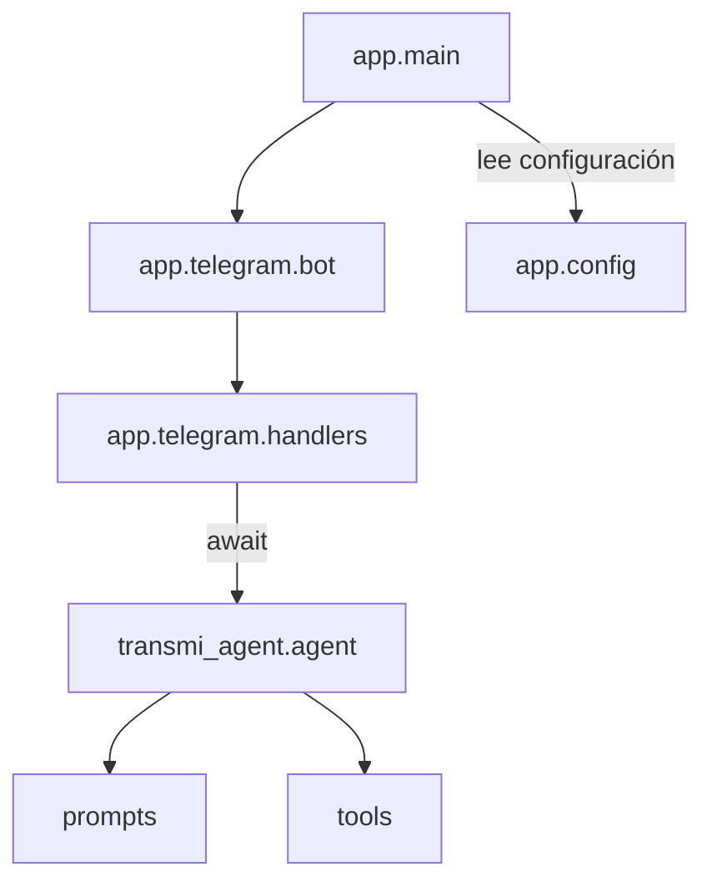

# Módulos y Responsabilidades

| Módulo | Responsabilidad principal | Dependencias clave | Notas de manejo de errores |
| ------ | ------------------------- | ------------------- | -------------------------- |
| `app.config` | Carga y valida configuraciones usando `pydantic-settings`. | `pydantic`, variables de entorno. | Normaliza listas (`TELEGRAM_ALLOWED_UPDATES`) y lanza `ValueError` ante formatos inválidos. |
| `app.logging_config` | Configura logging estructurado según el nivel definido en entorno. | `logging`, `get_settings()`. | Permite ajustar nivel sin modificar código. |
| `app.exceptions` | Define jerarquía de errores específicos del dominio. | N/A | Facilita captura diferenciada en `main`. |
| `app.main` | Punto de entrada: inicia logging, inicializa la base de datos, crea la aplicación de Telegram y gestiona webhook/polling. | `python-telegram-bot`, `app.telegram.bot`, `app.config`, `app.db`. | Inicializa el esquema de BD con `init_db()`, captura `ExternalServiceError` y excepciones inesperadas (envolviéndolas en `ConfigurationError`). |
| `app.telegram.bot` | Construye `Application` registrando comandos y handler de texto. | `python-telegram-bot`. | Centraliza registro de handlers para mejorar testabilidad. |
| `app.telegram.handlers` | Gestiona comandos `/start`, `/help`, errores y mensajes libres. Registra interacciones de usuario en la BD. | `invoke_agent`, `app.db.crud`. | Valida `update.message`, captura fallos del agente y devuelve mensaje amigable. En `handle_text`, usa `log_interaction_by_phone` de forma no bloqueante. |
| `app.agents.transmi_agent.agent` | Configura agentes ADK y runner, garantiza la sesión y expone `invoke_agent`. | `google-adk`, `asyncio`, `prompts`, `tools`. | Reintenta creación de sesión (idempotente) y transforma errores en `RuntimeError` controlada. |
| `app.agents.transmi_agent.prompts` | Contiene descripción e instrucciones del agente en español, referencias a herramientas. | N/A | Guía al agente para comunicar errores y mantener idioma correcto. |
| `app.agents.transmi_agent.tools` | Implementa `get_current_time`, `capture_simit_screenshot` y tools de TomTom (`tomtom_route_with_traffic`, `tomtom_find_nearby_services`, etc.) y registra opcionalmente placas/direcciones en la BD cuando se dispone de `phone_number`. | `playwright`, `logging`, `pathlib`, `app.services.tomtom`, `app.db.crud`. | Devuelve diccionarios estructurados, delega validación y manejo de errores en la capa de servicios (Simit y TomTom) y envuelve las escrituras a BD con manejo de errores defensivo. |

## Módulos de base de datos

| Módulo | Responsabilidad principal | Dependencias clave | Notas de manejo de errores |
| ------ | ------------------------- | ------------------- | -------------------------- |
| `app.db.session` | Configura el motor SQLite (`var/transmibot.db`), la sesión (`SessionLocal`) y el `Base` de SQLAlchemy. Expone `init_db()` para crear tablas. | `sqlalchemy`, `pathlib`. | Crea el directorio `var/` si no existe; `init_db()` es idempotente y se invoca al inicio de la app. |
| `app.db.models` | Define las tablas `User`, `Interaction`, `Plate` y `AddressSearch` con `phone_number` como identificador lógico principal. | `sqlalchemy`, `datetime`. | Diseño simple, con campos denormalizados como `phone_number` en tablas hijas para facilitar consultas sin joins pesados. |
| `app.db.crud` | Proporciona helpers de alto nivel para `get_or_create_user_by_phone`, `log_interaction_by_phone`, `log_plate_by_phone`, `log_address_search_by_phone`. | `sqlalchemy`, `app.db.session`, `app.db.models`. | Usa un decorador `_with_session` que maneja apertura/cierre de sesión, `commit`/`rollback` y captura/registro de excepciones, evitando que errores de BD rompan el flujo del bot. |

## Servicios auxiliares

- `var/screenshots/`: almacenamiento local de las capturas Simit generadas por
  Playwright. Ideal montarlo como volumen persistente en producción.
- `Makefile`: atajos para `uv sync`, ejecución local y comandos Docker.
- `Dockerfile`: empaqueta la aplicación con Playwright (revisar requisitos de
  dependencias del navegador al desplegar).

## Interacciones entre módulos

- Los módulos se comunican a través de funciones claramente tipadas (`invoke_agent`).
- Las herramientas pueden ejecutarse de forma asíncrona dentro del runner, pero
  exponen interfaces síncronas o `async` según lo requiera el ADK.

